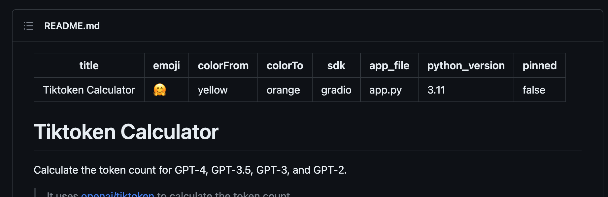

# Hugging Face Sync

Sync your GitHub repository to Hugging Face Spaces.

## Why

Hugging Face Spaces requires you to add a configuration section to the head of `README.md`, which is making it looks ugly on GitHub. This GitHub Action will automatically add the configuration section to `README.md` and sync your repository to Hugging Face Spaces.



Also, it syncs your repository in a clean repository. So you don't need to fight with some restrictions of Hugging Face Spaces, such as the file type limit and some files that are not allowed to be uploaded in old commits.

## Usage

Add the following GitHub Action to your repository:

```yaml
name: Sync to Hugging Face Spaces

on:
    push:
        branches:
            - main

jobs:
    sync:
        name: Sync
        runs-on: ubuntu-latest

        steps:
            - name: Checkout Repository
              uses: actions/checkout@v3

            # Remove files that you don't want to sync to Hugging Face Spaces
            # or blocked by Hugging Face Spaces.
            - name: Remove bad files
              run: rm -rf my-bad-files

            - name: Sync to Hugging Face Spaces
              uses: JacobLinCool/huggingface-sync@v1
              with:
                  github: ${{ secrets.GITHUB_TOKEN }}
                  user: jacoblincool # Hugging Face username or organization name
                  space: my-space # Hugging Face space name
                  token: ${{ secrets.HF_TOKEN }} # Hugging Face token
```

> You can find your Hugging Face token [here](https://huggingface.co/settings/token).

## Options

See [action.yml](action.yml) for the full list of options.
